# EchoRoom

EchoRoom is a protocol-first, real-time, anonymous messaging system built around **temporary rooms** that automatically expire.  
Mobile (Expo) and Web (ViteJS) clients share the **same socket protocol, backend rules, and domain model**.

There are no profiles, no message history, and no platform-specific logic at the protocol layer.

---

## Core Principles

- One shared WebSocket protocol
- One shared backend and socket server
- Cross-platform rooms (mobile ↔ web)
- Strict room-based access control
- Immutable messages
- Time-limited communication by design

---

## Documentation Structure

All documentation lives under the `docs/` folder.

```
docs/
├── ARCHITECTURE.MD
├── BRAND.MD
├── DATABASE.MD
├── SUPABASE.MD
├── PROTOCOL.MD
├── CONTRIBUTION.MD
├── mobile/
│   ├── README.md
│   └── screenshots/
└── web/
    ├── README.MD
    └── screenshots/
```

---

## Core Technical Documents

These files define the **authoritative behavior** of the system.

- **Architecture**
  - [`docs/ARCHITECTURE.MD`](./docs/ARCHITECTURE.MD)

- **Socket Protocol**
  - [`docs/PROTOCOL.MD`](./docs/PROTOCOL.MD)

- **Database Design (Conceptual)**
  - [`docs/DATABASE.MD`](./docs/DATABASE.MD)

- **Supabase Usage & Migrations**
  - [`docs/SUPABASE.MD`](./docs/SUPABASE.MD)

- **Brand & UI Rules**
  - [`docs/BRAND.MD`](./docs/BRAND.MD)

- **Contribution Rules**
  - [`docs/CONTRIBUTION.MD`](./docs/CONTRIBUTION.MD)

---

## Web Client (ViteJS)

- Documentation: [`docs/web/README.MD`](./docs/web/README.MD)

### Screenshots

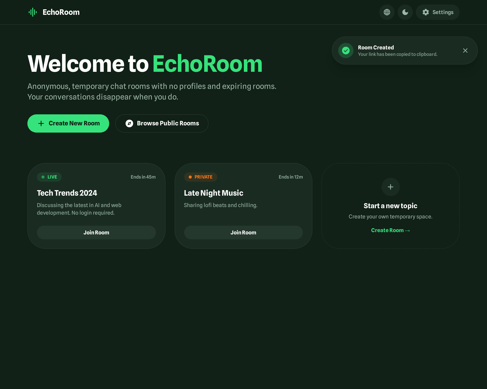
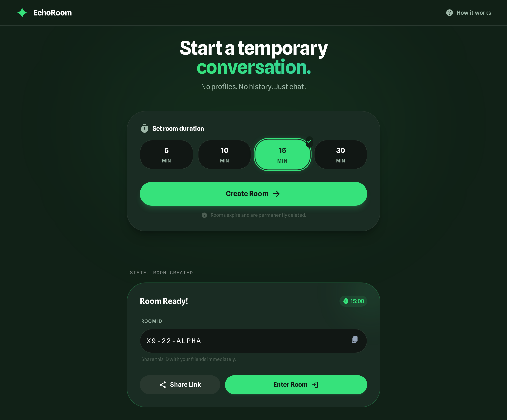
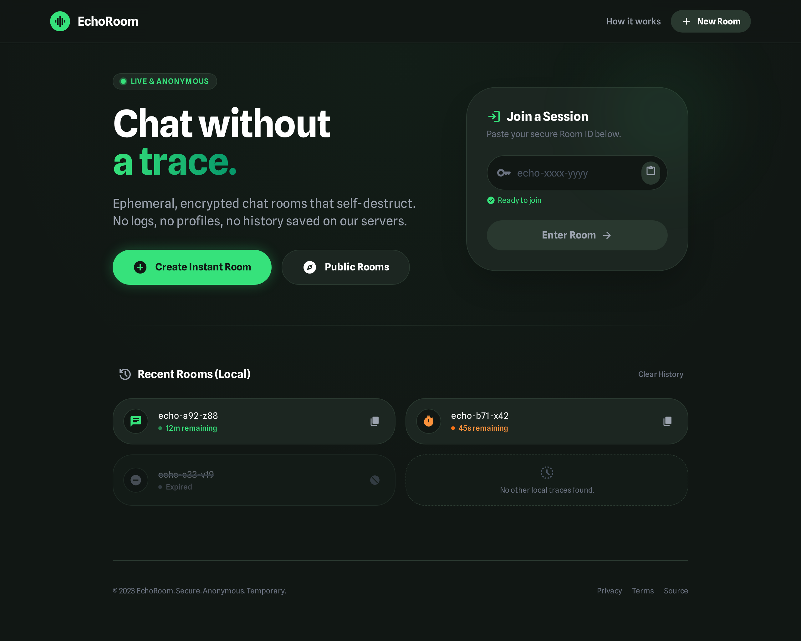
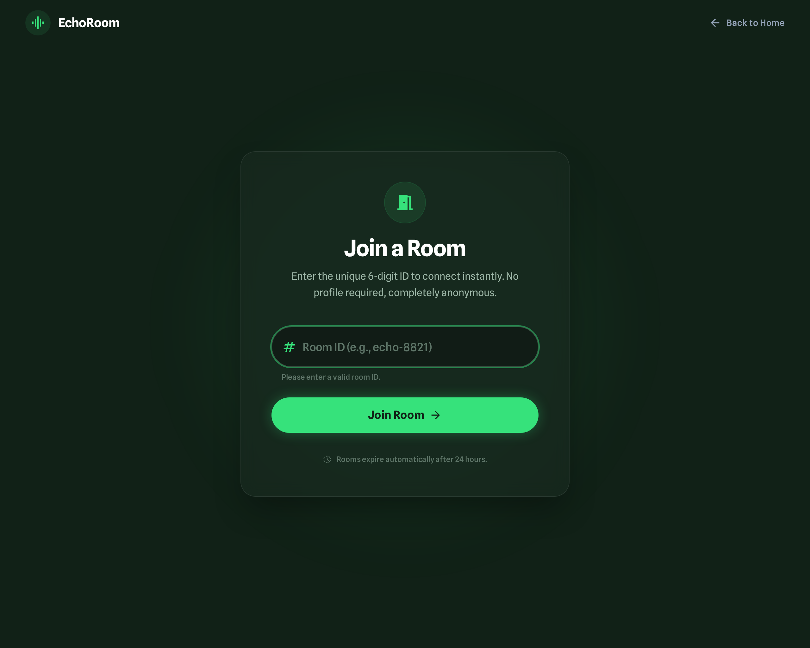
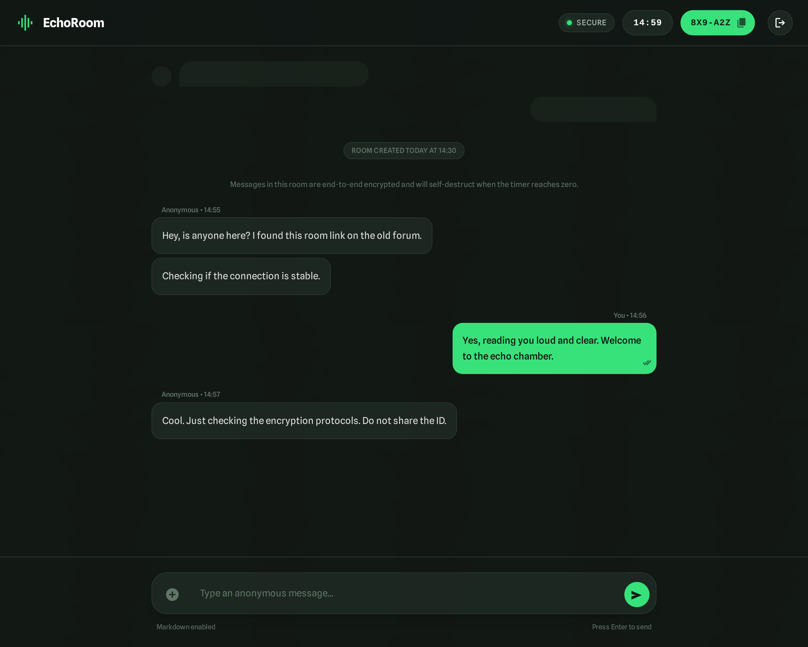
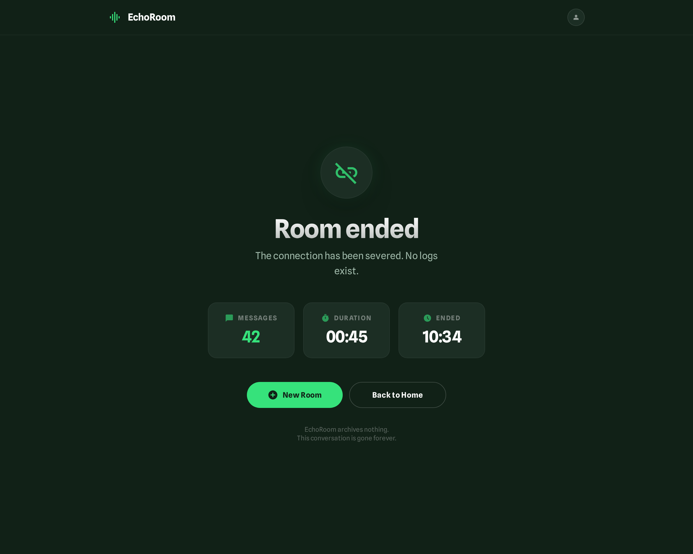
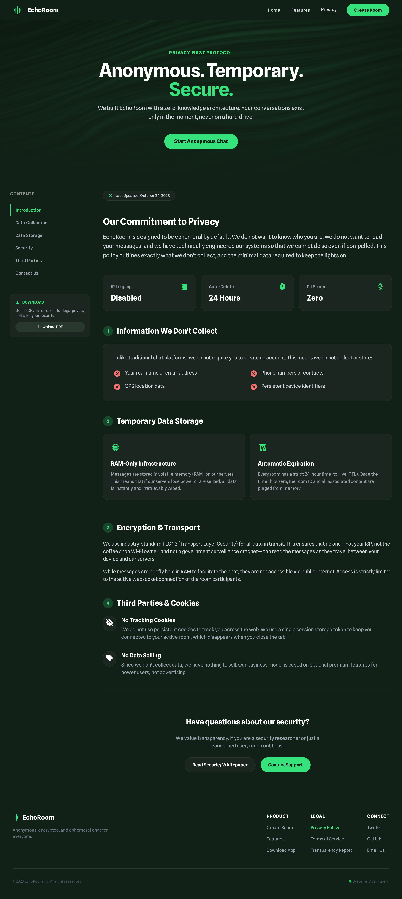

---

## Mobile Client (Expo)

- Documentation: [`docs/mobile/README.md`](./docs/mobile/README.md)

### Screenshots (9:16 optimized)

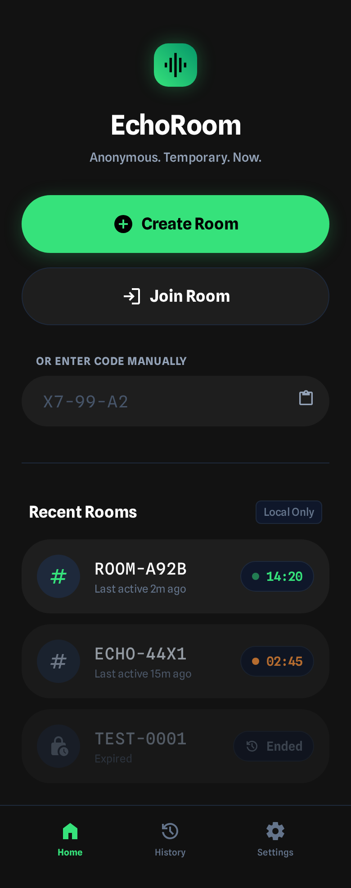

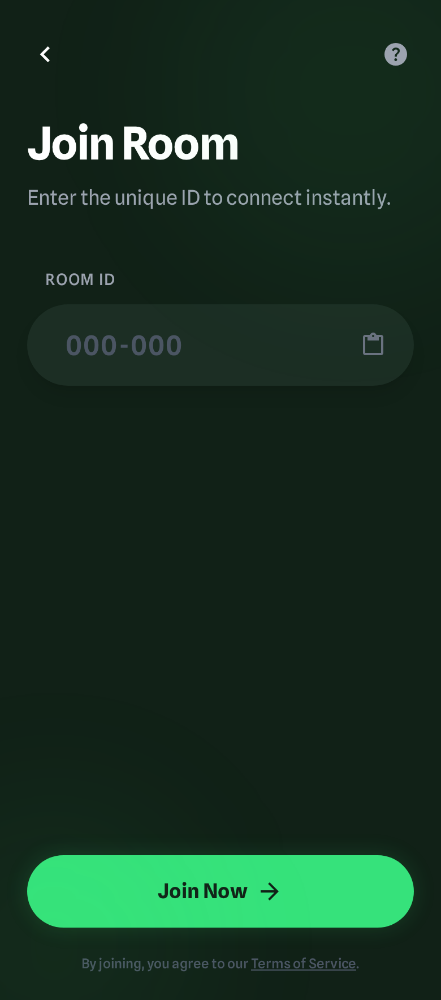
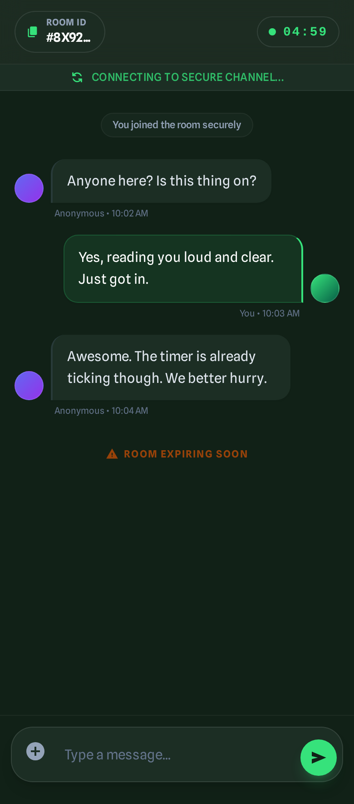
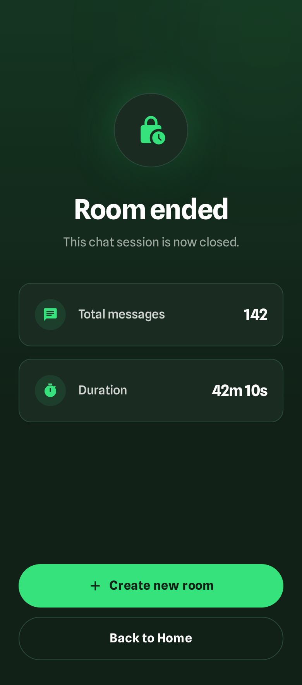
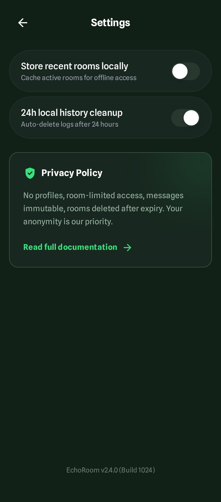

---

## Cross-Platform Contract (Non-Negotiable)

Mobile and web clients **must**:

- Use the same socket protocol (`PROTOCOL.MD`)
- Use the same database schema and rules (`DATABASE.MD`)
- Use the same domain models
- Connect to the same socket server
- Obey the same room lifecycle and expiry semantics

Platform differences are limited strictly to:
- UI layout
- Navigation
- Input ergonomics

Any divergence at the protocol, service, or data layer is a bug.

---

## Roadmap & Future Features

EchoRoom intentionally ships with a minimal, secure core.  
Advanced features are tracked separately to prevent architectural drift.

- **Roadmap & TODOs**
  - [`docs/TODO.MD`](./docs/TODO.MD)

Planned areas include:
- End-to-end encrypted rooms
- Password-based (ciphered) chats
- Privacy-preserving typing indicators
- Optional read receipts
- Performance and scalability improvements

All future features must comply with:
- Shared socket protocol
- Shared database schema
- Cross-platform parity
- Protocol-first design

Features that violate these rules will not be accepted.

---

## Status

- Protocol: defined
- Database schema + RLS: defined
- Supabase integration: defined
- Architecture: defined
- Web UI: documented
- Mobile UI: documented

EchoRoom is a **single system**, not two separate applications.

---

## Legal & Safety

EchoRoom is an open-source communication system.

Before using or deploying it, please review:

- [`LICENSE`](./LICENSE)
- [`docs/DISCLAIMER.md`](./docs/DISCLAIMER.md)
- [`docs/TERMS_OF_USE.md`](./docs/TERMS_OF_USE.md)

EchoRoom does not moderate content, monitor communications, or control third-party deployments.  
Users and deployers are solely responsible for lawful use.

---

## Security

EchoRoom takes security issues seriously.

- Responsible disclosure policy: [`SECURITY.md`](./SECURITY.md)
- Security vulnerabilities must be reported privately
- Public issues for security problems are not accepted

EchoRoom is not a hosted service.  
The maintainers do not operate production instances and are not responsible for third-party deployments.
