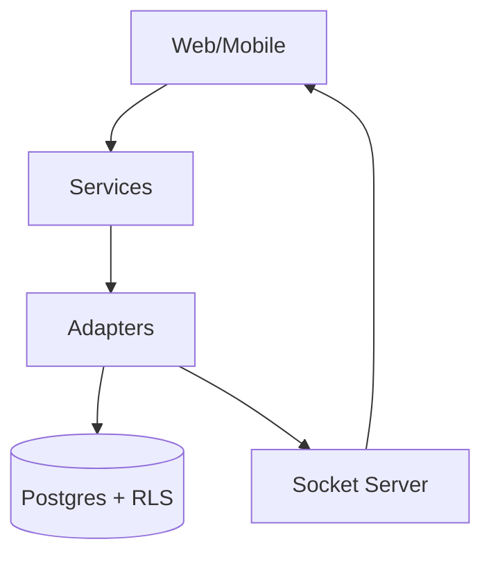

# EchoRoom Architecture Diagrams (MERMAID)

## System Architecture

```mermaid
graph TD
  UI[Web/Mobile]
  SVC[Services]
  ADAPT[Adapters]
  DB[(Postgres + RLS)]
  SOCK[Socket Server]

  UI --> SVC --> ADAPT --> DB
  ADAPT --> SOCK --> UI
```
